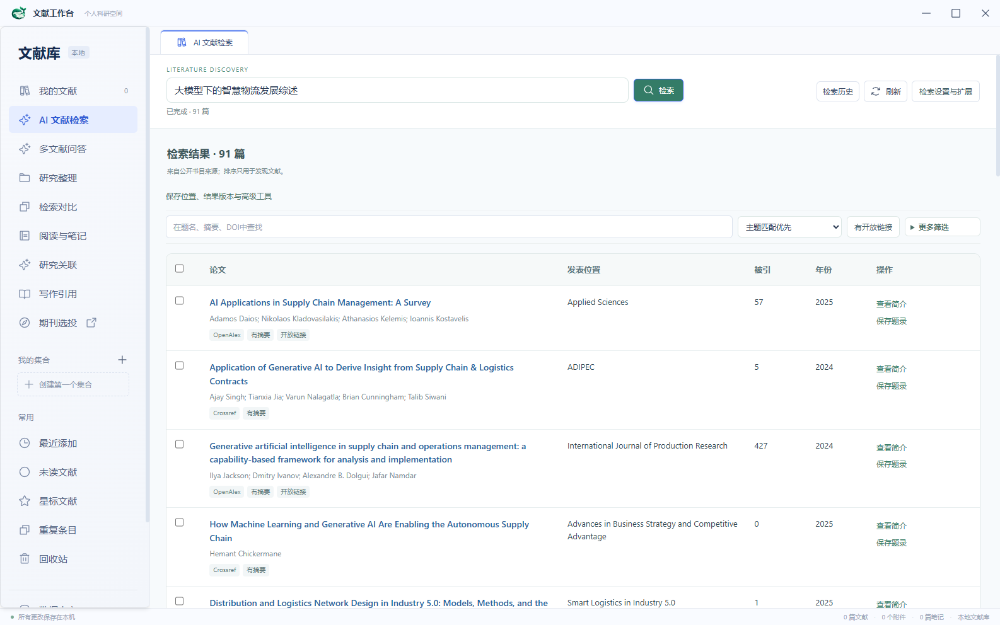

# 文献工作台

一款面向 **Windows x64** 的本地优先文献管理软件，覆盖文献发现、采集、整理、PDF 阅读、批注、跨文献分析和写作引用。个人文献库与附件保存在自己的电脑上；公开文献检索、开放全文获取和可选的 AI 功能需要联网。

当前版本：**0.9.33**。项目仍在开发中，升级前请先备份个人文献库。软件不是 Scholay、知网、Elsevier、Zotero 或其他学术平台的官方客户端。



## 从哪里开始

如果已经取得 Windows 安装包，可直接安装并启动；安装包自带运行时，使用软件不需要单独安装 Python 或 Node.js。仓库**不包含预编译安装包、个人文献、论文 PDF 或期刊源数据库**。从本仓库获取程序时，请按下方命令自行构建。

首次启动会在 Windows 的“文档”目录下建立“文献工作台”个人库。建议按这个顺序体验：

1. 在“我的文献”导入 PDF、RIS、BibTeX/BibLaTeX 或 CSL-JSON；先核对题录和重复提示，再保存。
2. 在“AI 文献检索”输入研究主题并按 Enter。结果页可排序、筛选开放链接，点击题名查看论文简介；勾选后可批量保存。
3. 打开库内 PDF 阅读、选中文字、做批注和笔记。需要 AI 翻译、解释或问答时，在“设置 → 阅读助手”配置自己的兼容服务。
4. 在“设置 → 备份与恢复”创建备份。更换电脑时通过备份恢复个人库；外部期刊源目录需要另行迁移。

更完整的操作步骤见 [使用指南](docs/使用指南.md)。

## 主要功能

| 模块 | 当前能力 |
| --- | --- |
| 文献库 | 导入题录与 PDF、批内及库内重复检测、集合与标签、智能集合、高级检索、回收站永久删除、备份与恢复 |
| 文献发现 | 从 OpenAlex、Crossref 等公开书目来源检索；可选 PubMed、arXiv；展示来源、摘要可用性、年份和被引数据，支持筛选、排序和批量保存 |
| 浏览器采集 | Chrome / Edge 扩展采集论文页面题录；识别当前文章的 PDF 入口，保存后验证、下载和索引 |
| PDF 阅读 | 连续阅读、双文献对照、原文与中文对照翻译、选区高亮与批注、阅读卡和术语表 |
| 研究分析 | 多文献问答、证据回链、文献关系图、跨文献比较与综述笔记；推断关系需要人工核对 |
| 期刊选投 | 对**用户自行提供的本地期刊索引**搜索、筛选与查看带来源和年份的指标 |
| 写作引用 | 导入/导出常见交换格式、CSL 引用样式，以及 Microsoft Word 加载项的动态引文 |

检索结果用于**发现候选文献**，排序、被引次数和期刊指标不等于论文质量判断。缺少摘要、全文或指标时，界面会保留缺失状态，不会自动补造。AI 生成内容也应回到原文核对。

### 浏览器扩展与 Word

安装版中可从“设置 → 浏览器采集”打开扩展目录。在 Chrome 的 `chrome://extensions` 或 Edge 的 `edge://extensions` 开启开发者模式，点击“加载已解压的扩展程序”并选择该目录。保持桌面端运行，扩展会自动连接本机文献库，**无需配对码**。网页缺少完整题录时，请在弹窗中补全后保存。扩展优先读取论文页的 PDF 元数据，同时识别常见出版商入口和页面上的 PDF 下载按钮。保存时可选用浏览器当前访问权限下载、由桌面端下载公开全文，或只保存题录；下载结果会在扩展图标和下次打开弹窗时显示。浏览器下载的原文件仍会留在浏览器设置的下载目录。

Word 写作加载项有独立的本机桥接和一次性配对码，用于让 Word 文档访问当前电脑上的文献库。当前**不支持 WPS**。详情见 [使用指南的写作引用部分](docs/使用指南.md#写作引用)。

## 联网、数据与隐私

个人题录、附件、批注、笔记、阅读记录与翻译缓存保存在本机。安装版默认使用 Windows“文档/文献工作台”；开发运行默认使用仓库根目录的 `library/`。文献库位置可以在设置中调整。AI 访问密钥由 Electron 调用系统加密存储，不写入文献库或备份。

| 操作 | 联网行为 |
| --- | --- |
| 阅读、整理、检索已有个人库 | 在本机完成 |
| AI 文献检索 | 将研究检索式发给所选公开书目来源；启用模型规划时，研究问题也会发给已配置的 AI 服务 |
| 打开检索结果的论文简介 | 如已配置 AI 服务，会发送来源提供的**公开题名、摘要和关键词**以生成中文译文，并在本机缓存 |
| 获取全文 | 请求来源允许访问的地址；付费墙和机构认证内容不会被绕过 |
| AI 辅助阅读、翻译和问答 | 按触发的功能发送所选原文、相关页面或所选文献的检索片段到用户配置的服务 |

“设置 → 允许手动联网查询”关闭后，本地库、已保存附件和笔记仍可使用，依赖外部服务的操作会停止。项目不提供云同步，也不会把个人文献库作为公网 HTTP 服务开放。浏览器扩展和 Word 加载项只通过本机回环接口连接桌面端。

本仓库只包含源码、文档和构建资源，不包含自动化测试代码。请勿将 `library/`、`data/`、`backups/`、凭据、采集会话、个人截图或未经许可的第三方全文加入 Git。期刊源数据和第三方论文 PDF **不随源码或安装包分发**。

## 从源码构建

需要 Windows x64、**Python 3.12**、**Node.js 24 与 npm**，以及 **PowerShell 7**（`pwsh`）。在仓库根目录执行：

```powershell
git clone https://github.com/nothingbody/research-library-desktop.git
cd research-library-desktop
pwsh -NoProfile -File .\build-desktop.ps1 -InstallDependencies
```

脚本会建立 `.venv-client/`、安装锁定依赖，并通过 PyInstaller 和 electron-builder 打包。成功后在 `dist/desktop/` 找到 `ResearchLibrary-Setup-<版本>-x64.exe`、`ResearchLibrary-Portable-<版本>-x64.exe` 和 `win-unpacked/`。以后依赖未变化时，可运行 `pwsh -NoProfile -File .\build-desktop.ps1`。**构建不会自动安装**，也不会把本机个人库或期刊数据放进安装包。

如需开发运行，先按 [开发指南](docs/开发指南.md) 初始化 Python 与 npm 依赖，再在 `desktop/` 执行 `npm run build` 和 `npm start`。单独的 `npm run dev` 只有前端页面，没有完整的本机 IPC 功能。

### 项目结构

| 路径 | 内容 |
| --- | --- |
| `desktop/src/` | React 界面、PDF 阅读器与交互 |
| `desktop/electron/` | Electron 主进程、受限 IPC、浏览器扩展与 Word 加载项 |
| `client_backend/` | Python 本地服务、SQLite、全文索引和联网适配 |
| `docs/` | 使用与开发说明 |
| `build-desktop.ps1` | Windows 打包入口 |

Electron 渲染进程不具有 Node 权限，主进程通过受限 IPC 与界面通信，并以逐行 JSON 连接 Python 子进程。打包细节见 [开发指南](docs/开发指南.md)。

## 常见问题与当前边界

- **期刊页没有数据或指标**：本仓库不附带期刊源库。需要自行提供有权使用的本地数据并建立索引；来源缺失的年份或指标不会自动推断。
- **网页扩展连接失败**：确认桌面端正在运行，并从当前安装版的扩展目录加载扩展；升级旧扩展时可先移除旧版再重新加载。
- **无法获取 PDF**：已识别入口不代表一定有下载权限。网站可能要求付费、机构认证或额外验证；请查看浏览器下载状态，再在文献库附件页核对是否已导入。可以先保存题录，之后手动添加自己有权使用的 PDF。
- **备份提示附件缺失或已修改**：备份仍会完成并保留题录与可读取的附件，清单会列出需要重新定位的文件；已修改的链接附件按当前内容备份。恢复时请检查这些提示。
- **合并后想恢复重复条目**：到“重复条目”撤销合并，不能从回收站单独恢复已经合并的来源条目。永久删除会清理库内托管附件，且无法撤销。
- **AI 不可用或译文不准确**：检查“设置 → 阅读助手”的地址、模型、密钥与联网状态；重要结论和排版请对照原文。双栏翻译的版式受 PDF 文字层与页面结构影响。
- **扫描 PDF 无法选字**：当前没有内置 OCR；没有文字层的页面不能参与文字选择和全文检索。
- **跨设备同步与 WPS**：当前版本尚未提供。

## 参与项目

欢迎提交可复现的问题和范围明确的改进。请先阅读 [贡献指南](CONTRIBUTING.md)；安全问题请按 [安全说明](SECURITY.md) 私密报告，勿在 Issue 中公开密钥或个人数据。

项目源码按 [Apache License 2.0](LICENSE) 发布。内置 CSL 中文区域文件及 GB/T 7714 样式分别遵循原项目许可，来源与署名见 [CSL NOTICE](desktop/electron/csl/NOTICE.md)；其他依赖遵循各自的上游许可证。
